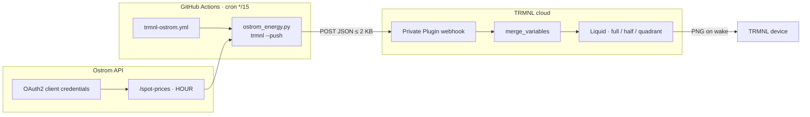

# trmnl-ostrom

Ostrom Germany day-ahead electricity prices (retail total EUR/kWh) on a [TRMNL](https://trmnl.com) e-ink display.

A GitHub Actions cron runs a single stdlib-only Python script every 15 minutes. The script authenticates with the Ostrom API, fetches day-ahead spot prices (hourly), computes the current hour, today's stats, the cheapest upcoming window and a sparkline, and POSTs a compact JSON payload to a TRMNL Private Plugin webhook. TRMNL renders it with the Liquid markup in this repo and the device pulls the image on its next wake.

Prices are **gross/total** (spot + taxes/levies) in **EUR/kWh**, labeled in **Europe/Berlin**. Optional `OSTROM_ZIP` includes local taxes and monthly fee fields from the API.

---

## How it works



| Loop | Driver | Cadence | What it does |
|---|---|---|---|
| **Push** | GitHub Actions cron | every 15 min | OAuth → fetch → compute → POST payload |
| **Pull** | TRMNL device firmware | playlist refresh (15–30 min) | fetch rendered image, sleep |

---

## Setup

1. **TRMNL → Plugins → Private Plugin → Add.** Strategy **Webhook**. Save. Copy the UUID from `https://trmnl.com/api/custom_plugins/<UUID>`.
2. **Markup.** Connect the plugin to this repo (folder `trmnl`) or paste each file from [`trmnl/src/`](trmnl/src/) into its layout tab. Title bar reads **Ostrom**.
3. **Local credentials** (never commit):
   ```bash
   cp .env.example .env
   # fill OSTROM_CLIENT_ID, OSTROM_CLIENT_SECRET, optional OSTROM_ZIP, TRMNL_PLUGIN_UUID
   bash run.sh trmnl              # dry-run JSON
   bash run.sh trmnl --push       # push once
   ```
4. **GitHub Actions secrets** on this repo:
   - `OSTROM_CLIENT_ID`
   - `OSTROM_CLIENT_SECRET`
   - `OSTROM_ZIP` (optional but recommended)
   - `TRMNL_PLUGIN_UUID`
   ```bash
   gh secret set OSTROM_CLIENT_ID -R pmagnomuller/trmnl-ostrom
   gh secret set OSTROM_CLIENT_SECRET -R pmagnomuller/trmnl-ostrom
   gh secret set OSTROM_ZIP -R pmagnomuller/trmnl-ostrom
   gh secret set TRMNL_PLUGIN_UUID -R pmagnomuller/trmnl-ostrom
   gh workflow run trmnl-ostrom.yml -R pmagnomuller/trmnl-ostrom
   ```
5. **Playlist.** Add the plugin. 15–30 min refresh is enough.

Field-by-field payload reference: [`trmnl/SETUP.md`](trmnl/SETUP.md).

---

## Local use

```bash
bash run.sh prices --hours 24
bash run.sh optimize --duration-hours 2
bash run.sh control --price-below 0.25 --on-command "echo on" --off-command "echo off"

bash run.sh trmnl                 # print payload, no push
bash run.sh trmnl --push          # push once
```

Thresholds are **EUR/kWh** (total = gross spot + taxes/levies). Timestamps use `Europe/Berlin`.

Configuration precedence: env / `.env` → `~/.config/ostrom-energy/config.json` → defaults.

---

## Payload

Same conceptual shape as [`trmnl-omie`](https://github.com/pmagnomuller/trmnl-omie):

| Field | Meaning |
|-------|---------|
| `current.price_label` | Total EUR/kWh for the active hour |
| `current.slot_label` | e.g. `09:00–10:00` (Berlin) |
| `today_*_label` | Today’s min / avg / max total EUR/kWh |
| `cheapest_next.label` | Next cheapest 1h block |
| `upcoming.t` / `p` / `bars` | Sparkline labels, cents/kWh, 0–10 heights |
| `tomorrow_ready` | `true` once tomorrow’s hours are in the API response |
| `updated_label` | Last push time (Berlin) |

If compact JSON exceeds 2000 bytes, `upcoming_count` shrinks (24 → 18 → 12 → 8 → 6).

---

## Repo layout

```
.
├── ostrom_energy.py              # OAuth, fetch, CLI, TRMNL push
├── run.sh                        # source .env, exec python3
├── requirements.txt              # stdlib only
├── .env.example                  # OSTROM_* + TRMNL_PLUGIN_UUID
├── config.json.example           # for ~/.config/ostrom-energy/
├── SKILL.md                      # agent-skill metadata
├── trmnl/
│   ├── SETUP.md
│   ├── .trmnlp.yml
│   └── src/                      # full / half_vertical / quadrant + settings.yml
└── .github/workflows/
    └── trmnl-ostrom.yml          # */15 cron + workflow_dispatch
```

---

## Safety

- Never commit `.env` or real credentials. `.gitignore` excludes `.env` and `.env.*` (except `.env.example`).
- Keep `control` in dry-run until thresholds are verified; only then add `--execute`.
- OAuth client secret and TRMNL UUID belong in GitHub Actions secrets only for CI.

---

## Related

- [`trmnl-omie`](https://github.com/pmagnomuller/trmnl-omie) — Iberian OMIE 15-min wholesale pattern this mirrors
- [`ostrom-energy`](https://github.com/pmagnomuller/ostrom-energy) — standalone skill without TRMNL packaging
- [Ostrom API docs](https://docs.ostrom-api.io/reference/api-access)
- TRMNL: [Private Plugins](https://help.trmnl.com/en/articles/9510536-private-plugins)
