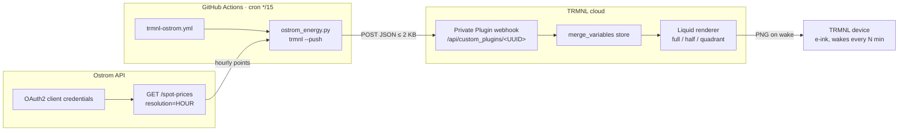
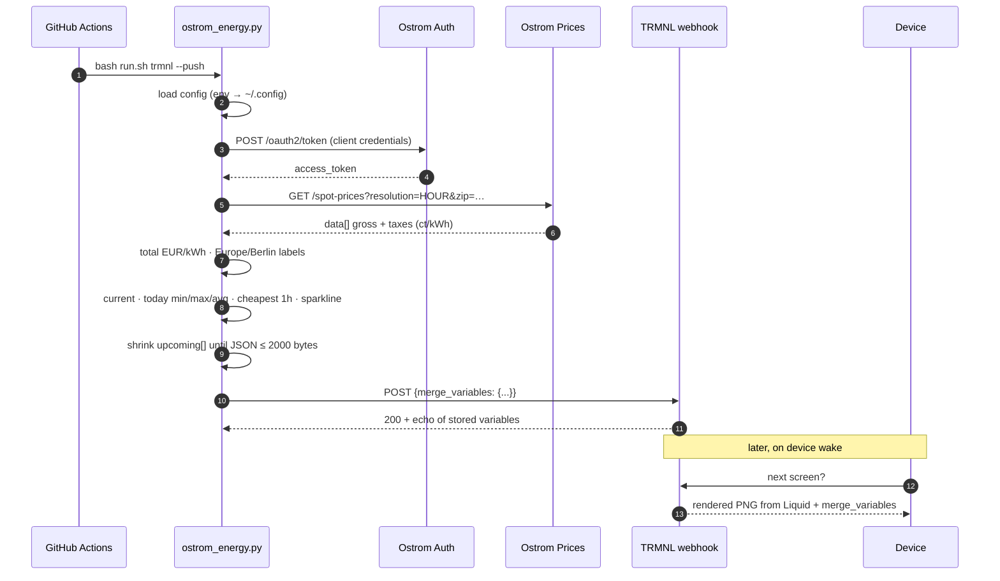
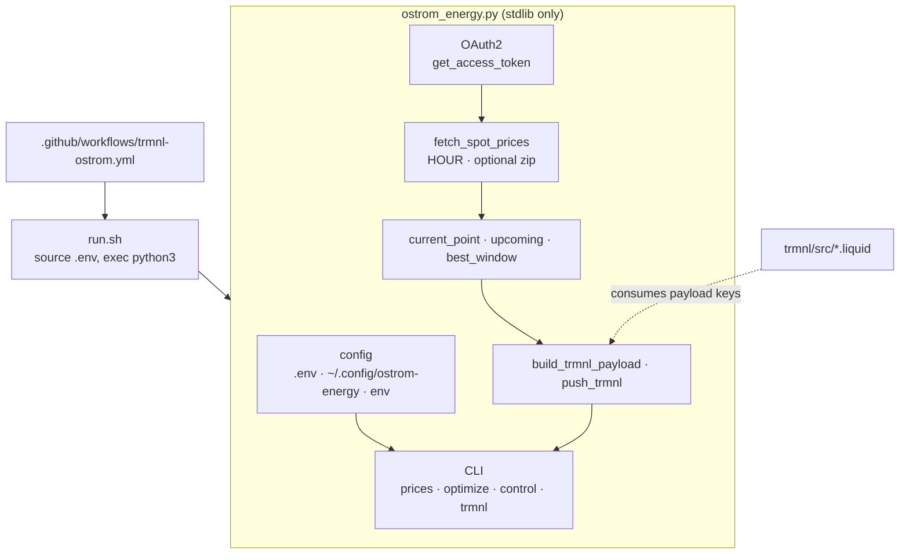
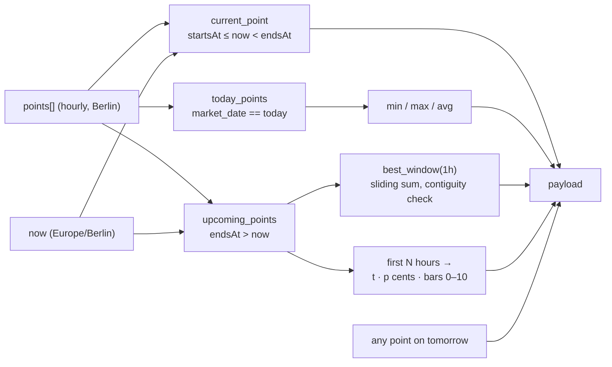
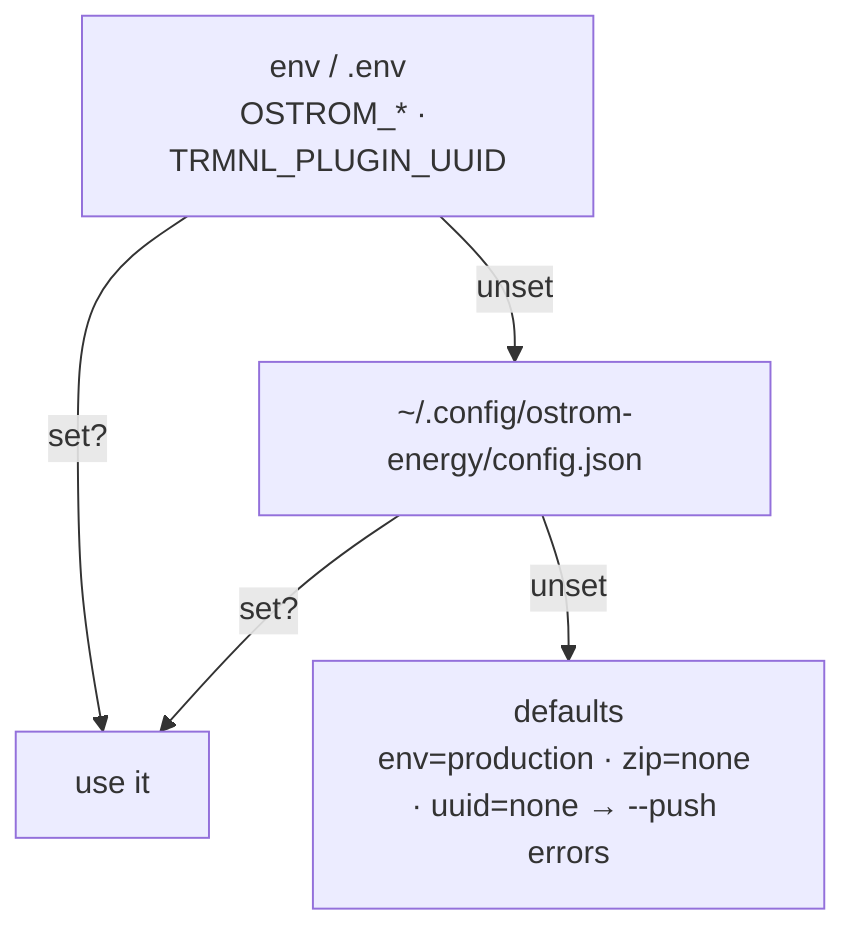

# trmnl-ostrom

Ostrom Germany day-ahead electricity prices (retail **total** EUR/kWh) on a [TRMNL](https://trmnl.com) e-ink display.

*Private Plugin: current hour, cheapest next hour, today’s min/avg/max, and upcoming sparkline — all Europe/Berlin.*

A GitHub Actions cron runs a single stdlib-only Python script every 15 minutes. The script authenticates with the [Ostrom API](https://docs.ostrom-api.io/reference/api-access), fetches day-ahead spot prices (hourly), computes the current hour, today's stats, the cheapest upcoming window and a sparkline, and POSTs a compact JSON payload to a TRMNL Private Plugin webhook. TRMNL renders it with the Liquid markup in this repo and the device pulls the image on its next wake.

Prices are **gross/total** (`grossKwhPrice` + `grossKwhTaxAndLevies`) in **EUR/kWh**. Optional `OSTROM_ZIP` includes local taxes/levies (and exposes monthly base/grid fee fields from the API). Timestamps use **Europe/Berlin**.

Secrets required: `OSTROM_CLIENT_ID`, `OSTROM_CLIENT_SECRET`, optional `OSTROM_ZIP`, and `TRMNL_PLUGIN_UUID`. Never commit real credentials.

---

## Table of contents

- [How it works](#how-it-works)
  - [System overview](#system-overview)
  - [Data flow, one push](#data-flow-one-push)
  - [Where the time goes](#where-the-time-goes)
- [Architecture](#architecture)
  - [Components](#components)
  - [Data source: Ostrom `/spot-prices`](#data-source-ostrom-spot-prices)
  - [Payload](#payload)
  - [Rendering](#rendering)
  - [Configuration precedence](#configuration-precedence)
- [Setup](#setup)
- [Local use](#local-use)
- [Repo layout](#repo-layout)
- [Design decisions](#design-decisions)
- [Safety](#safety)
- [Related](#related)

---

## How it works

### System overview



Two independent loops, decoupled by TRMNL's `merge_variables` store:

| Loop | Driver | Cadence | What it does |
|---|---|---|---|
| **Push** | GitHub Actions cron | every 15 min | OAuth → fetch → compute → POST payload |
| **Pull** | TRMNL device firmware | playlist refresh (15–30 min) | fetch rendered image, sleep |

The device never talks to this repo or to Ostrom. TRMNL always has the last successful payload, so a failed push just means a stale slot label, not a blank screen.

### Data flow, one push



### Where the time goes

```mermaid
gantt
    title Timing on a typical day (Europe/Berlin)
    dateFormat HH:mm
    axisFormat %H:%M
    section Ostrom / EEX
    Today's curve available (day-ahead)              :done, 00:00, 24h
    Tomorrow's curve published (afternoon)           :milestone, 13:00, 0m
    section Push loop
    Cron every 15 min                                :active, 00:00, 24h
    section Payload
    tomorrow_ready = false                           :00:00, 13h
    tomorrow_ready = true                            :13:00, 11h
```



Day-ahead prices only change when the market (and Ostrom’s API) publish the next day. The 15-minute cron exists to move the “Now” hour label, recompute the cheapest-next window from the current time, and flip `tomorrow_ready` once tomorrow’s hours appear in the response.

---

## Architecture

### Components



- **`run.sh`** loads a local `.env` if present, then `exec`s the script.
- **`ostrom_energy.py`** is one file on purpose: Python 3.9+, no third-party packages (`urllib`, `json`, `zoneinfo`, `argparse`).
- **Liquid templates** only place payload strings. Connect the plugin to this repo (`trmnl/`) for GitHub sync, or paste markup by hand.
- **Workflow** checks out, sets up Python 3.12, runs `bash run.sh trmnl --push` with secrets.

### Data source: Ostrom `/spot-prices`

```
POST https://auth.production.ostrom-api.io/oauth2/token
GET  https://production.ostrom-api.io/spot-prices
       ?startDate=…&endDate=…&resolution=HOUR&zip=10115
```

Each row includes (among others):

| Field | Meaning |
|-------|---------|
| `date` | Hour start (UTC in the API response) |
| `grossKwhPrice` | Spot with VAT (ct/kWh) |
| `grossKwhTaxAndLevies` | Taxes/levies with VAT (ct/kWh); needs `zip` |
| `grossMonthlyOstromBaseFee` / `grossMonthlyGridFees` | Monthly fixed fees (not folded into EUR/kWh) |

The script converts **total ct/kWh → EUR/kWh** for display, optimize, control, and TRMNL. Labels are rewritten to **Europe/Berlin**. API resolution is **HOUR** (Ostrom’s documented enum); the cron still runs every 15 minutes so the UI stays current within the hour.

### Payload

`build_trmnl_payload` produces this shape (trimmed):

```json
{
  "area": "DE",
  "area_label": "Germany · 10115",
  "updated_at": "2026-09-23T10:50:36+02:00",
  "updated_label": "10:50",
  "current": {
    "price_eur_kwh": 0.3698,
    "price_cents_kwh": 37,
    "price_label": "0.3698",
    "gross_ct_per_kwh": 16.83,
    "taxes_ct_per_kwh": 20.15,
    "total_ct_per_kwh": 36.98,
    "starts_at": "2026-09-23T10:00:00+02:00",
    "ends_at": "2026-09-23T11:00:00+02:00",
    "slot_label": "10:00–11:00"
  },
  "today": { "min": 0.2698, "max": 0.5247, "avg": 0.3891 },
  "today_min_label": "0.2698",
  "today_max_label": "0.5247",
  "today_avg_label": "0.3891",
  "cheapest_next": {
    "starts_at": "...", "ends_at": "...",
    "label": "13:00–14:00",
    "avg_eur_kwh": 0.2698, "avg_cents_kwh": 27, "hours": 1
  },
  "upcoming": {
    "t": ["10:00", "11:00", "..."],
    "p": [37, 32, "..."],
    "bars": [4, 2, "..."],
    "count": 14
  },
  "tomorrow_ready": false
}
```

Same conceptual shape as [`trmnl-omie`](https://github.com/pmagnomuller/trmnl-omie):



- **`bars`** are min-max normalised to integers 0–10 for Liquid `height: {{ h | times: 10 }}%`.
- **Size guard**: if compact JSON exceeds 2000 bytes, `upcoming_count` retries at 18, 12, 8, 6. Typical payload is well under 1 KB.
- **`tomorrow_ready`** is true once any returned hour falls on tomorrow’s Berlin calendar date.

### Rendering

| Template | Uses |
|---|---|
| `full.liquid` | `current.*`, `cheapest_next.*`, `today_*_label`, `upcoming.*`, `area_label`, `updated_label`, `tomorrow_ready` |
| `half_vertical.liquid` | current, cheapest next, today stats |
| `quadrant.liquid` | current price + slot, cheapest next label |

Title bar: **Ostrom**.

### Configuration precedence



---

## Setup

1. **TRMNL → Plugins → Private Plugin → Add.** Strategy **Webhook**. Save. Copy the UUID from `https://trmnl.com/api/custom_plugins/<UUID>`.
2. **Markup.** Connect the plugin to this repo (plugin → *Connect to GitHub*, folder `trmnl`) so `trmnl/src/*.liquid` sync both ways, or paste each file from [`trmnl/src/`](trmnl/src/) into its layout tab.
3. **Ostrom API credentials** from the [Ostrom developer portal](https://docs.ostrom-api.io/reference/api-access). Prefer a ZIP so taxes/levies are non-zero.
4. **Test from your machine** before CI:
   ```bash
   cp .env.example .env
   # fill OSTROM_CLIENT_ID, OSTROM_CLIENT_SECRET, OSTROM_ZIP, TRMNL_PLUGIN_UUID
   bash run.sh trmnl              # dry-run JSON
   bash run.sh trmnl --push       # → Pushed to TRMNL (200): {...}
   ```
5. **Enable the cron:**
   ```bash
   gh secret set OSTROM_CLIENT_ID -R <you>/trmnl-ostrom
   gh secret set OSTROM_CLIENT_SECRET -R <you>/trmnl-ostrom
   gh secret set OSTROM_ZIP -R <you>/trmnl-ostrom          # optional
   gh secret set TRMNL_PLUGIN_UUID -R <you>/trmnl-ostrom
   gh workflow run trmnl-ostrom.yml -R <you>/trmnl-ostrom
   gh run watch -R <you>/trmnl-ostrom
   ```
6. **Playlist.** Add the plugin. 15–30 min refresh is enough.

Field-by-field reference and troubleshooting: [`trmnl/SETUP.md`](trmnl/SETUP.md).

---

## Local use

The same script is a general Ostrom CLI / agent skill.

```bash
bash run.sh prices --hours 24
bash run.sh optimize --duration-hours 2
bash run.sh optimize --kwh 28 --power-kw 11

# dry-run: prints which command would fire
bash run.sh control --price-below 0.25 \
  --on-command "echo on" --off-command "echo off"
# add --execute to actually run them

bash run.sh trmnl                 # print payload, no push
bash run.sh trmnl --push          # push once
```

Thresholds for `optimize` / `control` are **EUR/kWh** (total). All display timestamps are `Europe/Berlin`.

---

## Repo layout

```
.
├── ostrom_energy.py              # OAuth, fetch, compute, CLI, TRMNL push
├── run.sh                        # source .env, exec python3
├── requirements.txt              # empty on purpose (stdlib only)
├── .env.example                  # OSTROM_* + TRMNL_PLUGIN_UUID placeholders
├── config.json.example           # same keys, for ~/.config/ostrom-energy/
├── SKILL.md                      # agent-skill metadata (OpenClaw / ClawHub)
├── trmnl/
│   ├── SETUP.md                  # TRMNL walkthrough + payload field table
│   ├── .trmnlp.yml               # trmnlp serve / GitHub sync config
│   └── src/
│       ├── settings.yml          # plugin settings (strategy, refresh, name)
│       ├── full.liquid
│       ├── half_vertical.liquid
│       └── quadrant.liquid
└── .github/workflows/
    └── trmnl-ostrom.yml          # */15 cron + workflow_dispatch
```

---

## Design decisions

- **Push, not poll.** Webhook + GitHub Actions needs nothing hosted; Polling would need a public JSON URL.
- **Stdlib only.** Survives skill runners and CI without `pip install`.
- **One file.** Easy to copy; no package layout.
- **Compute on the pusher, not in Liquid.** Liquid has no date math and clumsy floats. Labels and bar heights are precomputed.
- **Total EUR/kWh, not spot-only.** Matches what you actually pay per kWh on a dynamic Ostrom tariff when ZIP is set. Monthly fees stay informational, not amortized into the sparkline.
- **Hourly data, 15-minute cron.** Ostrom’s prices API documents `resolution=HOUR`. The cron still refreshes so “Now” and cheapest-next stay honest inside the hour.
- **Idempotent pushes.** Every run rebuilds the full payload. No state, safe to re-run.
- **Fail loud in CI, fail soft on tomorrow.** Missing secrets exit 1. Missing tomorrow’s curve is normal until afternoon publication.

---

## Safety

- Never commit `.env` or real credentials. `.gitignore` excludes `.env` and `.env.*` (except `.env.example`).
- Keep `control` in dry-run until thresholds look right; only then add `--execute`.
- OAuth client secret and TRMNL UUID belong in GitHub Actions secrets for CI — not in the repo, not in Liquid markup.

---

## Related

- [`trmnl-omie`](https://github.com/pmagnomuller/trmnl-omie) — Iberian OMIE 15-min wholesale pattern this mirrors
- [`ostrom-energy`](https://github.com/pmagnomuller/ostrom-energy) — standalone skill without TRMNL packaging
- [Ostrom API docs](https://docs.ostrom-api.io/reference/api-access)
- Writeup: [OpenClaw on My Homelab](https://pedro-muller.com/homelab/openclaw-on-my-homelab/)
- TRMNL docs: [Private Plugins](https://help.trmnl.com/en/articles/9510536-private-plugins)
